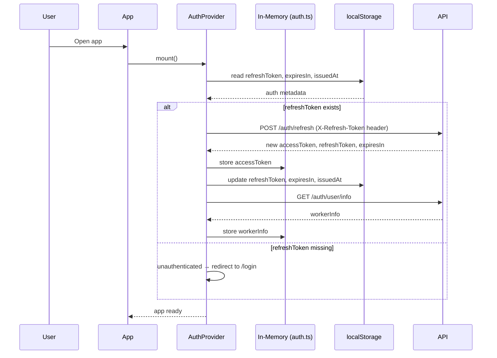
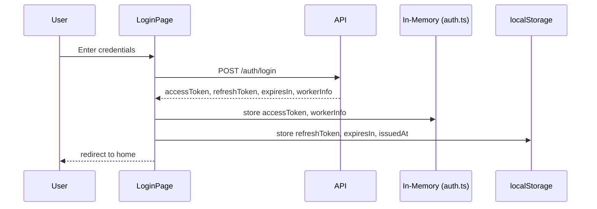
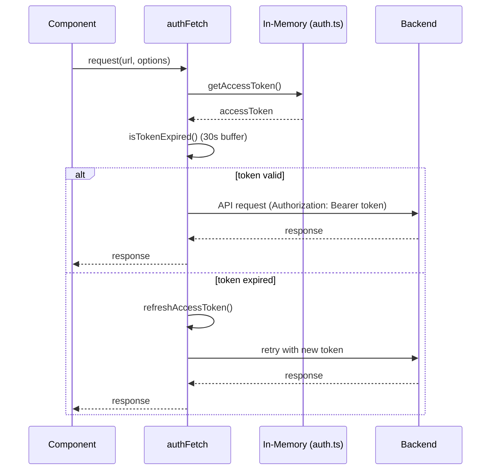
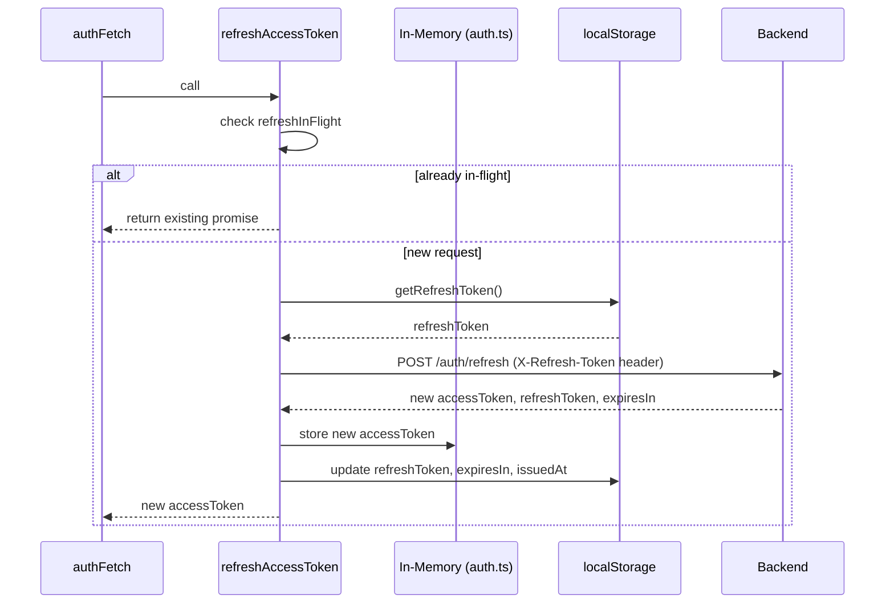
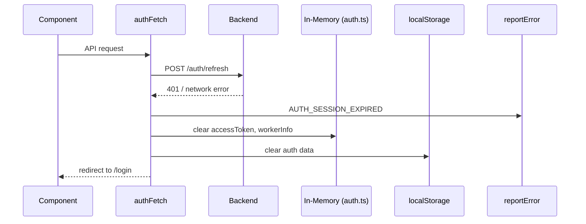
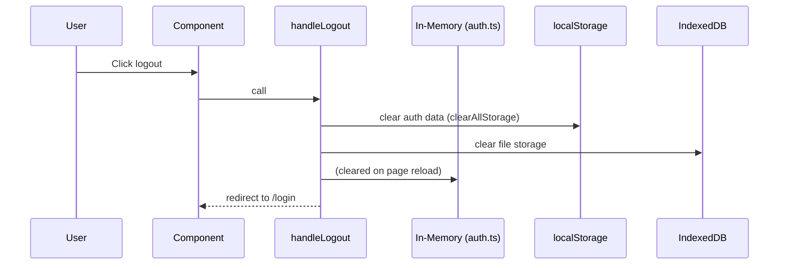

# Auth & Login Flow

Sequence diagrams for every auth-related path. Source of truth lives in [`src/lib/auth.ts`](src/lib/auth.ts) and [`src/contexts/AuthContext.tsx`](src/contexts/AuthContext.tsx).

## Key invariants

- **Access token** is held in-memory only (`inMemoryAccessToken` in `lib/auth.ts`). It is lost on every reload and reconstructed via `/auth/refresh`.
- **Refresh token** (+ `expiresIn`, `issuedAt`) lives in `localStorage` via `authStorage`.
- `refreshAccessToken()` deduplicates concurrent calls via a singleton `refreshInFlight` promise — handles StrictMode double-mount and race conditions.
- All authed API calls go through `authFetch()`; public calls go through `loggedFetch()`. Never call `fetch()` directly.

---

## 1. App startup (hydration)

---

## 2. Login

---

## 3. Authenticated API request

---

## 4. Token refresh (deduplicated)

---

## 5. Refresh failure → logout

---

## 6. Logout

