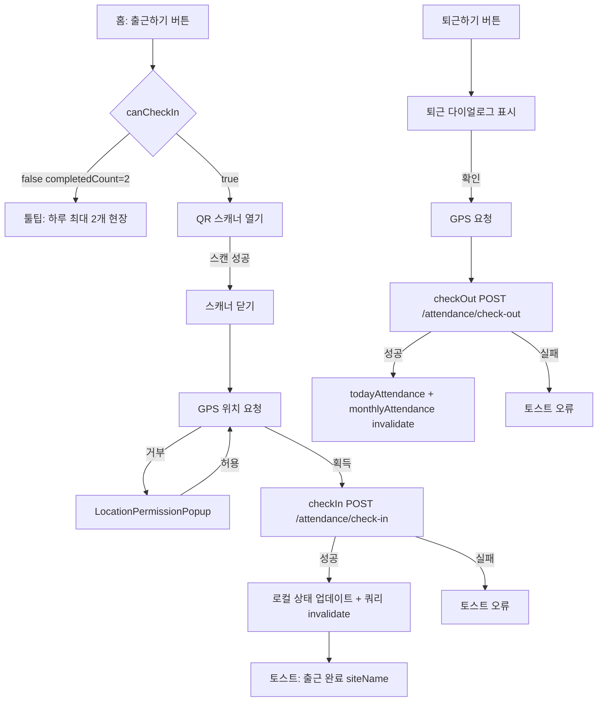

# 워커 모바일 앱 — 프로덕션 QA 시나리오 문서

> 전체 코드베이스 분석을 기반으로 작성. 회원가입, 온보딩, 프로필, 서류, 출퇴근 기능을 포함.

---

# 기능: SMS 인증 및 회원가입 진입

## 사용자 플로우
1. 로그인 화면 → "회원 가입" 탭 → `/signup`
2. 선택: "내 명의 휴대폰" (NICE 리다이렉트) 또는 "타인 명의 휴대폰" (SMS)
3. 휴대폰 번호 입력 → "인증번호 받기" 탭 → 6자리 코드 입력 → "인증하기" 탭
4. 성공 시 → `/signup/agreement`

## Mermaid 플로우차트
```mermaid
flowchart TD
    A[로그인 화면] --> B[/signup]
    B --> C{인증 방법}
    C -->|내 명의| D[NICE 외부 리다이렉트]
    D --> E[/signup/nice-return]
    E -->|requestNo 유효| F[/signup/agreement]
    E -->|requestNo 없음 또는 API 실패| G[/signup - showError]
    C -->|타인 명의| H[/signup/sms-verification]
    H --> I[휴대폰 번호 11자리 입력]
    I --> J[getSmsCode POST /auth/register/send-code]
    J -->|성공| K[OTP 입력창 표시]
    J -->|실패| L[showError 토스트 - 화면 유지]
    K --> M{코드 입력}
    M -->|WebOTP Android| N[OTPCredential로 자동 입력]
    M -->|iOS Safari| O[QuickType 추천]
    M -->|수동| P[사용자가 6자리 입력]
    N & O & P --> Q[verifySmsCode POST /auth/register/verify-code]
    Q -->|성공| R[phone + registrationToken 저장 - sessionStorage]
    R --> F
    Q -->|실패| S[showError 토스트 - 화면 유지]
```

## 상태 전환
| 상태 | 트리거 | 다음 상태 |
|-------|---------|------------|
| idle | 마운트 | phone_entry |
| phone_entry | 11자리 입력 완료 | can_request |
| can_request | "인증번호 받기" 탭 | sending |
| sending | getSmsCode 응답 | code_entry (성공) / error (실패) |
| code_entry | 6자리 입력 완료 | can_verify |
| can_verify | "인증하기" 탭 | verifying |
| verifying | verifySmsCode 응답 | agreement_redirect (성공) / error (실패) |

## API 플로우
| 액션 | 엔드포인트 | 메서드 | 페이로드 | 성공 | 오류 |
|--------|----------|--------|---------|---------|-------|
| 코드 발송 | `/auth/register/send-code` | POST | `{ phone }` | OTP 입력창 표시 | showError |
| 코드 검증 | `/auth/register/verify-code` | POST | `{ phone, code }` | registrationToken 저장 → 이동 | showError |
| NICE 토큰 | `/auth/nice/token` | GET | — | NICE로 리다이렉트 | showError |
| NICE 결과 | `/auth/nice/result/{requestNo}` | GET | — | name/phone 저장 → 이동 | /signup으로 돌아가기 |

## 유효성 검사 규칙
- 휴대폰: 숫자 제거 후 정확히 11자리
- 코드: 정확히 6자리
- 허니팟 필드: 입력 시 → 제출 차단(isBotDetected), UI에 표시 없음
- "인증번호 받기" 버튼: `!isPhoneComplete || isSending`이면 비활성화
- "인증하기" 버튼: `code.length !== 6 || isVerifying`이면 비활성화

## 엣지 케이스
- **탭 닫기**: sessionStorage 초기화 → 회원가입 데이터 손실 → 처음부터 다시 시작
- **코드 재요청**: 코드에 재발송 타이머 없음; 사용자가 페이지를 새로고침해야 함
- **NICE requestNo 없음**: /signup으로 돌아가며 오류 토스트 표시
- **WebOTP 중단**: OTP 도착 전에 수동 입력 시, 6번째 자리 입력 시 `AbortController.abort()` 호출
- **getSmsCode 전 네트워크 오프라인**: fetch 예외 발생 → showError "본인확인 서비스를 시작할 수 없습니다."
- **인증번호 받기 연속 탭**: `isSending` 가드로 중복 방지, 백엔드 중복 제거 미확인

## 오류 처리
- 모든 오류 → `showError(result.error)` 토스트 (3초 자동 닫힘)
- 재시도 UI 없음 — 버튼을 다시 탭해야 함
- NICE 실패 → 리다이렉트 후 토스트 표시

## 오프라인 케이스
- 휴대폰 번호 입력: 오프라인에서도 동작 (로컬만)
- getSmsCode: 네트워크 오류로 실패 → 토스트
- verifySmsCode: 네트워크 오류로 실패 → 토스트, 코드 입력창 유지

---

# 기능: 회원가입 폼 (내국인 / 외국인 / 여권)

## 사용자 플로우
약관 동의 → 내국인/외국인 선택 → [주민등록번호 | 외국인등록번호 | 외국인등록번호→여권번호] → 비밀번호 설정 → 완료

## Mermaid 플로우차트
```mermaid
flowchart TD
    A[/signup/agreement] -->|동의하기| B[/signup/domestic-foreign]
    B -->|내국인| C[/signup/signup-rrn]
    B -->|외국인| D[/signup/signup-frn]
    D -->|여권번호로 가입하기| E[/signup/signup-pn]
    C & D & E --> F[/signup/set-password]
    F -->|registerWorker 성공| G[signupStorage.clear]
    G --> H[/signup/complete]
    H -->|로그인하기| I[/login]
    F -->|API 실패| J[showError - 화면 유지]
```

## 상태 전환 (비밀번호 설정)
| 상태 | 조건 |
|-------|-----------|
| invalid | 비밀번호 조건 미충족 또는 비밀번호 불일치 |
| valid | 모든 조건 충족 및 비밀번호 일치 |
| submitting | "다음" 탭 (isSubmitting=true) |
| success | registerWorker 성공 → 이동 |
| error | registerWorker 실패 → showError, isSubmitting=false |

## API 플로우
| 엔드포인트 | 메서드 | 페이로드 |
|----------|--------|---------|
| `POST /auth/register/worker` | POST | `{ password, nameKo, nameEn?, mobilePhone, nationalityType, nationality?, idType, idNumber, address, addressDetail:'', gender?, birthDate?, personalInfoConsent, registrationToken }` |

## 유효성 검사 규칙

### 주민등록번호 (내국인)
- nameKo: 비어있지 않음, 한글만, 최대 4자
- ssnFirst: 정확히 6자리
- ssnSecond: 정확히 7자리
- address: 비어있지 않음 (카카오 우편번호)
- phone: 미리 입력된 읽기 전용

### 외국인등록번호
- nameKo: 비어있지 않음, 한글만, 최대 4자
- nameEn: 선택
- frnFirst: 정확히 6자리
- frnSecond: 정확히 7자리
- address: 비어있지 않음

### 여권번호
- nameKo: 비어있지 않음, 한글만, 최대 4자
- nameEn: 선택
- passport: 비어있지 않음, 최대 12자, 영문/숫자 대문자
- nationality: 비어있지 않음 (API 딕셔너리)
- birthDate: 비어있지 않음 (YYYY-MM-DD)
- gender: 선택
- address: 비어있지 않음

### 비밀번호
- 길이: 8–64자
- 포함 필수: `/[a-zA-Z]/`, `/[0-9]/`, `/[^a-zA-Z0-9]/`
- confirmPassword가 password와 일치해야 함
- 최대 64자 오류 메시지 표시

## 엣지 케이스
- **비밀번호 설정에서 뒤로가기**: signupStorage 유지 (초기화 안됨), sessionStorage에서 폼 복원
- **한글 이름 5번째 자 입력 시도**: 4자로 잘리고 오류 메시지 표시 (maxLength 속성 미사용)
- **주민번호 자동 포커스**: ssnFirst 6자 입력 시 ssnSecond로 자동 포커스 (ref.focus())
- **registrationToken 없음**: 빈 문자열로 registerWorker 호출 — 백엔드가 거부할 수 있음
- **주민번호 입력 중 탭 새로고침**: 같은 탭이면 sessionStorage 유지 — `signupStorage.getData()`에서 폼 복원
- **국적/성별 딕셔너리 로드 실패**: API 실패 시 선택창 비어있음 (오류 UI 없음)
- **비밀번호 특수문자 엣지**: 공백과 이모지도 `/[^a-zA-Z0-9]/`로 특수문자로 처리됨

## 중복 요청 위험
- `isSubmitting`이 비밀번호 설정을 보호하지만, 뒤로가기 후 재제출 시 → 동일 registrationToken으로 두 번째 가입 시도 → 백엔드가 멱등성을 처리해야 함

## 오류 처리
- registerWorker 실패: 토스트, 비밀번호 설정 화면 유지, isSubmitting=false
- 필드별 서버 오류 매핑 없음 (전역 토스트만)

---

# 기능: 온보딩 플로우

## 사용자 플로우
최초 로그인 → `/onboarding` → 근무자 유형 → [용역회사 | 장비기사] → 급여계좌 → [본인계좌 | 가족계좌] → 서류등록 → 일급입력 → 홈

## Mermaid 플로우차트
```mermaid
flowchart TD
    A[최초 로그인] --> B{sessionStorage\npostLoginFirstLogin}
    B -->|=1| C[/onboarding]
    B -->|없음| D[/home]
    C -->|시작하기| E[/onboarding/worker-type]
    E -->|일반| F[/onboarding/payroll-account]
    E -->|용역| G[/onboarding/outsourcing]
    E -->|장비기사| H[/onboarding/engineer]
    G --> F
    H --> N[/onboarding/daily-wage]
    F -->|본인계좌| I[/onboarding/my-account]
    F -->|가족계좌| J[/onboarding/family-account]
    F -->|소속회사| N
    I --> K[/onboarding/documents]
    J --> K
    K -->|다음| N
    K -->|나중에 하기| D
    N -->|submitOnboarding+wage+complete| O[완료 다이얼로그]
    O -->|확인| D
    C -->|뒤로가기| P{나가기 다이얼로그}
    P -->|나가기| Q[로그아웃 → /login]
    P -->|계속하기| C
```

## 상태 전환 (일급 입력 제출 — 3단계 순차 API 호출)
| 단계 | API | 실패 시 동작 |
|------|-----|-----------------|
| 1 | `POST /profile/worker/onboarding` | showError, 중단 |
| 2 | `PUT /system/worker/me/daily-wage` | showError, 중단 — 1단계 이미 커밋됨 |
| 3 | `POST /system/worker/me/complete` | showError, 중단 — 1·2단계 커밋됨 |

**위험:** 2단계 또는 3단계 실패 시 부분 커밋. 롤백 없음. 사용자에게 오류 표시되지만 온보딩 일부가 서버에 저장됨.

## API 플로우
| 페이지 | 엔드포인트 | 메서드 | 페이로드 |
|------|----------|--------|---------|
| 용역회사 | `GET /system/partner/active` | GET | — |
| 본인계좌 | `PUT /system/worker/me/payment` | PUT | `{ wagePaymentTarget:'SELF', bankName, bankAccount, accountHolder, accountHolderRelation:null }` |
| 본인계좌 | `POST /system/worker/me/complete` | POST | — |
| 가족계좌 | `PUT /system/worker/me/payment` | PUT | `{ wagePaymentTarget:'PROXY', bankName, bankAccount, accountHolder, accountHolderRelation }` |
| 일급입력 | `POST /profile/worker/onboarding` | POST | `{ draft fields }` |
| 일급입력 | `PUT /system/worker/me/daily-wage` | PUT | `{ dailyWage }` |
| 일급입력 | `POST /system/worker/me/complete` | POST | — |

## 유효성 검사 규칙
- 용역회사: selectedCompany 비어있지 않음
- 장비기사: representativeName.trim() 비어있지 않음
- 본인계좌: 은행 선택 + accountNumber ≥7자리
- 가족계좌: familyName + 관계 + 은행 + accountNumber ≥7자리
- 일급: amount > 0

## 로딩 상태
- 용역회사: `useActivePartners()` 조회 → 스피너
- 본인계좌 / 가족계좌: `useBankNames()` 조회 → 로드 전까지 선택창 비어있음
- 일급입력: 3단계 API 호출 중 `isSubmitting` → 버튼 비활성화

## 오류 상태
- 용역회사 조회 실패: 재시도 버튼이 있는 `QueryErrorState`
- 은행 조회 실패: 선택창 옵션 없음 (조용히 실패)
- 결제 수단 업데이트 실패: showError, 페이지 유지
- 일급입력 단계 실패: showError, `isSubmitting=false`, 유지

## 오프라인 케이스
- 파트너 목록 조회 실패 → QueryErrorState
- 결제 수단 제출 실패 → 토스트, 유지
- 일급 제출 실패 → 토스트, 부분 서버 상태 가능

## 조건부 이동 케이스
| 근무자 유형 | 유형 선택 후 경로 |
|-----------|----------------|
| 일반 | → 급여계좌 |
| 용역 | → 용역회사 → 급여계좌 (소속회사 옵션 표시) |
| 장비기사 | → 장비기사정보 → 일급입력 (급여계좌 완전 건너뜀) |

## 온보딩 뒤로가기 차단
- `window.history.pushState()`로 히스토리에 센티넬 추가
- `popstate` 이벤트 인터셉트 → 나가기 다이얼로그 표시
- "나가기" 클릭 시 `flushSync()`로 `logout()` 호출
- **위험 (StrictMode)**: 더블 마운트로 센티넬이 두 번 푸시되어 뒤로가기를 두 번 눌러야 할 수 있음

## 드래프트 컨텍스트
- `OnboardingDraftContext`는 `useRef` 사용 — 쓸 때 리렌더링 없음
- 데이터는 메모리에만 존재 — 온보딩 중 페이지 새로고침 시 손실
- 페이지는 제출 시에만 드래프트 읽음

## 경쟁 조건 위험
- 파트너 목록 + 은행 목록 동시 조회 — 순서 의존성 없음, 안전
- 3단계 일급 API: "저장" 빠르게 탭해도 `isSubmitting` 가드로 중복 없음

---

# 기능: 내 정보 (프로필 수정)

## Mermaid 플로우차트
```mermaid
flowchart TD
    A[/profile] --> B[개인정보 row]
    B --> C{idType}
    C -->|resident_id| D[/profile/myinfo-rrn]
    C -->|alien_registration| E[/profile/myinfo-frn]
    C -->|passport| F[/profile/myinfo-pn]
    D & E & F -->|주소 변경 + 저장| G[PUT /system/worker/me]
    D -->|이름+주민번호 변경 + 저장| H[POST /system/worker]
    G & H -->|성공| I[토스트 + 페이지 유지]
    G & H -->|실패| J[토스트 오류]
```

## 유효성 검사 규칙
- 모든 idType 폼: 주소 필수, 휴대폰 읽기 전용 (모달에서 변경)
- 주민등록번호 수정: 이름 + 주민번호 모두 필수, 한글만, 최대 4자
- 외국인등록번호/여권번호 수정: 신분증 필드 읽기 전용, 주소만 수정 가능
- 저장 버튼: `!isFormValid || !hasChanges || isSubmitting`이면 비활성화

## 엣지 케이스
- **hasChanges 가드**: 저장 탭 시 불필요한 API 호출 방지
- **생년월일 형식**: "YYYYMMDD"(8자)로 저장된 경우, 로드 시 "YYYY-MM-DD"로 자동 변환
- **성별 딕셔너리 "알 수 없음" 필터링**: 라디오 목록에 표시 안 됨
- **휴대폰 변경 모달**: 인라인으로 열리며 프로필 폼과 별도로 제출
- **useWorkerProfile의 staleTime: Infinity**: 저장 후 자동 갱신 안 됨; 반드시 invalidate 필요

---

# 기능: 계좌 등록 (본인 계좌 / 가족 계좌)

## Mermaid 플로우차트
```mermaid
flowchart TD
    A[홈 배너: 계좌 정보 입력이 완료되지 않았어요] --> B[/profile]
    B --> C[계좌정보 row]
    C --> D[/profile/payroll-account]
    D -->|본인 계좌| E[/profile/my-account]
    D -->|가족 계좌| F[/profile/family-account]
    D -->|소속 회사 - labor_service만| G[PUT payment COMPANY]
    E --> H[PUT /system/worker/me/payment SELF]
    F --> I[PUT /system/worker/me/payment PROXY]
    H & I -->|성공| J[workerProfile + homeData invalidate → /profile]
    H & I -->|실패| K[showError]
    G -->|성공| L[invalidate → /profile]
    G -->|실패| K
```

## 유효성 검사 규칙
- 은행: 필수 (`/bank/names` API 딕셔너리)
- 계좌번호: ≥7자리, 숫자만
- 가족 이름: 필수
- 관계: 필수 (딕셔너리 `/dictItems?category=account_holder_relation`)

## 엣지 케이스
- **소속 회사 옵션**: `profile.workerCategory.toLowerCase() === 'labor_service'`인 경우만 표시
- **은행 목록 로드 실패**: 선택창 비어있음 — 저장 불가 (버튼 비활성화 유지)
- **관계 코드 불일치**: 백엔드가 대소문자 혼합으로 코드 또는 라벨을 반환할 수 있음 — 클라이언트가 대소문자 구분 없는 매칭 + 별칭 테이블로 정규화
- **Profile staleTime Infinity**: 저장 후 명시적 `invalidateQueries(['workerProfile'])` 필요 (정상 처리됨)
- **홈 배너 초기화**: `invalidateQueries(['homeData'])` 필요 — 저장 후 처리됨

## 경쟁 조건 위험
- 저장 전 본인계좌에서 뒤로가기 → 결제 대상 미업데이트 → 홈 배너 유지

---

# 기능: 서류 업로드

## Mermaid 플로우차트
```mermaid
flowchart TD
    A[/profile/documents 또는 /onboarding/documents] --> B[GET /document/summary]
    B --> C[서류 목록 렌더링 - alien_reg_front/back 필터링]
    C --> D{각 서류}
    D -->|state=missing method=upload| E[사진촬영 + 파일선택 표시]
    D -->|state=completed| F[보기 버튼 표시]
    D -->|method=eformsign| G[탭 → 토스트 안내]
    D -->|code=equipment_license| H[/profile/equipments로 이동]
    E -->|파일 선택| I[숨겨진 파일 입력 클릭]
    E -->|사진 촬영| J[촬영 가이드 표시]
    J --> K[카메라 촬영]
    K --> L[base64를 File로 변환]
    I & L --> M[dispatchUpload code file]
    M --> N[POST /document/slug multipart]
    N -->|성공| O[documentSummary invalidate + 토스트 제출되었습니다]
    N -->|실패| P[토스트 오류]
    O & P --> Q[uploadingCode 초기화]
```

## 상태 전환
| 상태 | 의미 |
|-------|---------|
| idle | 업로드 진행 없음 |
| uploading | `uploadingCode !== null` (한 번에 하나씩) |
| success | invalidation + 토스트 표시 |
| error | 오류 토스트 표시, uploadingCode 초기화 |

## API 플로우
| 서류 | 엔드포인트 | Multipart 필드 |
|----------|----------|-----------------|
| 신분증 | `POST /document/id-card` | `file` |
| 통장사본 | `POST /document/bankbook` | `file, accountHolder?, bankName?, bankAccount?` |
| 안전교육이수증 | `POST /document/safety-cert` | `file` |
| 가족관계증명서 | `POST /document/family-relation` | `file` |
| 여권 | `POST /document/passport` | `file, nationality?, passportExpiryDate?` |
| 외국인등록증 | `POST /document/alien-reg` | `frontFile?, backFile?, nationality?, residenceStatus?, periodStart, periodEnd` |

## 파일 업로드 중단 처리
- **업로드 중 네트워크 끊김**: `authFetch` 예외 → `dispatchUpload`에서 캐치 → 오류 토스트, uploadingCode 초기화
- **파일 너무 큼** (>10MB): POST 전에 `validateFile()`에서 오류 반환 — 토스트로 표시
- **잘못된 형식**: `validateFile()`이 MIME 확인 — 업로드 전 오류 토스트
- **업로드 중 이동**: 취소 메커니즘 없음 — fetch가 백그라운드에서 계속 진행; 컴포넌트 언마운트 시 결과 폐기
- **중복 업로드**: 가드 없음 — 동일 서류 재업로드 가능; 백엔드가 덮어씀

## 업로드 진행 상태
- 바이트 단위 진행률 표시 없음 (XMLHttpRequest / ReadableStream 미사용)
- `uploadingCode`가 모든 파일 버튼 비활성화 (업로드 중인 것만이 아님)
- `uploadingCode === doc.code`일 때 해당 카드에 업로드 스피너 표시

## 재시도 처리
- 자동 재시도 없음
- 오류 토스트 표시; 사용자가 버튼을 다시 탭해야 함
- 오류 후 `uploadingCode` 초기화되어 재시도 가능

## 엣지 케이스
- **외국인등록증 하위 코드 필터링**: `alien_reg_front`, `alien_reg_back` 미표시 — 부모 `alien_reg` 카드만
- **eformsign 서류**: "전자서명 서류는 별도 진행이 필요합니다." 토스트 — 업로드 UI 없음
- **equipment_license**: 업로드 대신 `/profile/equipments`로 이동
- **이미 업로드된 서류**: "보기" 버튼 표시 — 단, "파일 선택"으로 재업로드도 가능
- **카메라 촬영 중단**: 확인 전 CaptureGuide 닫기 → 파일 미설정, uploadingCode는 null 유지
- **Blob URL 누수**: `useBlobUrl` 훅이 변경/언마운트 시 revoke 처리; 수동 장기 URL은 ref로 추적

## 오프라인 케이스
- 파일 업로드 즉시 실패 → 오류 토스트
- 서류 목록 로드 실패 → `isError` 상태 → 재시도 버튼이 있는 `QueryErrorState` 컴포넌트

---

# 기능: 출퇴근 체크인 / 체크아웃

## Mermaid 플로우차트


## 상태 전환
| 상태 | canCheckIn | canCheckOut | 표시 |
|-------|-----------|------------|---------|
| 출근 전 | true | false | "출근하기" 활성 |
| 근무 중 | false | true | "퇴근하기" + 현장 정보 |
| 야근 중 | false | true | "퇴근하기" + "야근 중" 뱃지 |
| 퇴근 완료 (1회) | true (count<2이면) | false | "출근하기" 활성 |
| 퇴근 완료 (2회) | false | false | 비활성 툴팁 |

## API 플로우
| 액션 | 엔드포인트 | 주요 필드 |
|--------|----------|-----------|
| 출근 | `POST /system/attendance/check-in` | workerId, siteId, clientTimestamp, gps*, qrNonce* |
| 퇴근 | `POST /system/attendance/check-out` | workerId, siteId, clientTimestamp, gps* |
| 야근 | `POST /system/attendance/{id}/overtime-request` | — |
| 정정 | `POST /system/worker/me/attendance/correction-request` | attendanceId, workEntryId, requestType, reason |

## 출근 활성화 조건
다음 조건이 모두 충족될 때 출근 가능:
1. `isCheckedIn === false`
2. `completedCount < 2`
3. `!isProcessing`

## 경쟁 조건 위험
- **출근 버튼 연속 탭**: `isProcessing` 가드로 첫 번째 요청 중 두 번째 탭 방지
- **QR 스캔 + 위치 경쟁**: 스캔 완료 후에만 위치 요청 (순차적, 안전)
- **homeData 오래됨**: 출근 후 `['homeData']` invalidate 안 됨 — `onboardingCompleted` 배너가 30초 stale 만료까지 유지될 수 있음
- **월별 + 일별 invalidation 동시 발생**: 출근 후 동시에 트리거 — 독립 키이므로 안전

## 오프라인 / 네트워크 오류 처리
- GPS 없음: GPS 없이 출근 진행 (선택 필드)
- 출근 API 실패: `isProcessing=false`, 오류 토스트 표시
- 오프라인 큐 없음 — 출근은 실시간으로 성공해야 함

## 모바일 앱 백그라운드 / 복원
- 액세스 토큰 메모리: 탭 닫기/복원 시 손실
- 복원 시: `AuthContext` useEffect가 `refreshAccessToken()` → `fetchUserInfo()` 호출
- 갱신 실패 시: 로그인으로 리다이렉트
- `checkinSiteStorage` (localStorage)가 마지막 현장 정보 캐시 — API 없이도 새로고침 후 복원

---

# 기능: 급여 지급 준비 상태

## 조건 매트릭스
| 조건 | 출처 | 표시 배너 |
|-----------|--------|-------------|
| `onboardingCompleted === false` | `homeData.onboardingCompleted` | "계좌 정보 입력이 완료되지 않았어요" |
| `requiredDocsCompleted === false` | `useDocumentSummary().requiredDocsCompleted` | "제출하지 않은 서류가 있어요" |
| `unsignedCount > 0` | `useContracts()` signingStage 필터링 | "서명하지 않은 서류가 있어요" |

## 출퇴근 가용성 의존성
- 출퇴근 체크인은 온보딩/서류 완료 여부와 무관하게 가능
- 세 가지 배너가 동시에 표시될 수 있음
- 클라이언트 측 강제 없음 — 백엔드가 자체 규칙에 따라 거부할 수 있음

## 부분 완료 상태
| 상태 | 결과 |
|-------|--------|
| 계좌 설정, 서류 없음 | `onboardingCompleted=true`, 서류 배너 여전히 표시 |
| 서류 업로드, 계좌 없음 | 계좌 배너 표시, 출퇴근 가능 |
| 계좌 설정 + 서류 업로드 | 두 배너 모두 사라짐, 출퇴근 완전 가능 |
| `onboardingCompleted=null` | 배너 미표시 (null을 알 수 없음으로 처리, false 아님) |

---

# 조건부 이동 매트릭스

## 회원가입 이동
| 조건 | 경로 |
|-----------|-------|
| 본인 명의 NICE | `/signup` → NICE 외부 → `/signup/nice-return` → `/signup/agreement` |
| 타인 명의 SMS | `/signup` → `/signup/sms-verification` → `/signup/agreement` |
| 내국인 | `/signup/domestic-foreign` → `/signup/signup-rrn` |
| 외국인 | `/signup/domestic-foreign` → `/signup/signup-frn` |
| 외국인등록번호 없음 | `/signup/signup-frn` → 링크 클릭 → `/signup/signup-pn` |

## 온보딩 이동
| 근무자 유형 | 유형 선택 후 다음 | 건너뜀 |
|-----------|----------------|-------|
| 일반 | 급여계좌 | 없음 |
| 용역 | 용역회사 → 급여계좌 | 없음 |
| 장비기사 | 장비기사정보 → 일급입력 | 급여계좌, 서류등록 |

## idType별 프로필 이동
| idType | 프로필 수정 경로 |
|--------|-------------------|
| resident_id | `/profile/myinfo-rrn` |
| alien_registration | `/profile/myinfo-frn` |
| passport | `/profile/myinfo-pn` |

## 홈 배너 이동
| 배너 | 목적지 |
|--------|------------|
| 계좌 미완료 | `/profile` |
| 미서명 계약 | `/contract` |
| 미제출 서류 | `/profile/documents` |

---

# Playwright 자동화 매핑

## 로케이터 전략
| UI 요소 | 권장 로케이터 |
|------------|---------------------|
| 휴대폰 입력 | `page.getByPlaceholder('010-0000-0000')` |
| OTP 입력 | `page.getByPlaceholder('인증번호 입력')` |
| "인증번호 받기" | `page.getByRole('button', { name: '인증번호 받기' })` |
| "인증하기" | `page.getByRole('button', { name: '인증하기' })` |
| "동의하기" | `page.getByRole('button', { name: '동의하기' })` |
| "내국인" | `page.getByRole('button', { name: '내국인' })` |
| "외국인" | `page.getByRole('button', { name: '외국인' })` |
| 이름 입력 | `page.getByPlaceholder('이름 입력')` |
| 주민번호 앞자리 | `page.getByPlaceholder('앞 6자리')` |
| 주민번호 뒷자리 | `page.getByPlaceholder('뒤 7자리')` |
| "다음" | `page.getByRole('button', { name: '다음' })` |
| "저장" | `page.getByRole('button', { name: '저장', exact: true })` |
| "파일 선택" | `page.getByRole('button', { name: '파일 선택' }).first()` |
| 은행 선택 트리거 | `page.getByRole('button', { name: '은행 선택' })` |
| 은행 옵션 | `page.locator('[data-value="bankCode"]')` |
| 근무자 유형 카드 | `page.getByText('용역').first()` |
| 홈 배너 계좌 | `page.getByText('계좌 정보 입력이 완료되지 않았어요')` |
| 홈 배너 서류 | `page.getByText('제출하지 않은 서류가 있어요')` |
| 토스트 성공 | `page.getByText('저장되었습니다.')` |
| 토스트 제출 | `page.getByText('제출되었습니다.')` |

## 권장 테스트 ID (`data-testid` 추가 대상)
```
signup-method-nice          → "내 명의 휴대폰이 있어요" 카드
signup-method-sms           → "타인 명의 휴대폰이 있어요" 카드
sms-phone-input             → 휴대폰 번호 입력
sms-request-btn             → "인증번호 받기" 버튼
sms-code-input              → 인증번호 입력
sms-verify-btn              → "인증하기" 버튼
nationality-domestic        → "내국인" 버튼
nationality-foreign         → "외국인" 버튼
signup-next-btn             → "다음" 버튼 (비밀번호 설정)
onboarding-start-btn        → "시작하기" 버튼
worker-type-general         → "일반" 카드
worker-type-service         → "용역" 카드
worker-type-equipment       → "장비기사" 카드
payroll-self                → "본인 계좌" 카드
payroll-proxy               → "가족 계좌" 카드
payroll-company             → "소속 회사" 카드
account-bank-trigger        → 은행 드롭다운 트리거
account-number-input        → 계좌번호 입력
account-holder-input        → 예금주명 입력
daily-wage-input            → 일급 숫자 입력
doc-upload-btn-{code}       → 서류 코드별 "파일 선택"
doc-status-badge-{code}     → 서류 코드별 상태 뱃지
home-banner-account         → 계좌 미완료 배너
home-banner-docs            → 서류 미완료 배너
checkin-btn                 → "출근하기" 버튼
checkout-btn                → "퇴근하기" 버튼
```

---

# 미구현 요구사항 / QA 위험 항목

| # | 위험 | 심각도 | 영역 |
|---|------|----------|------|
| 1 | SMS 재발송 타이머 없음 — 사용자가 쿨다운 시간을 알 수 없음 | Medium | SMS 인증 |
| 2 | 일급입력: 3단계 순차 API에 롤백 없음 — 부분 커밋 가능 | High | 온보딩 |
| 3 | signupStorage가 sessionStorage에 있어 탭 닫기 시 손실, 복구 불가 | High | 회원가입 |
| 4 | OnboardingDraft가 메모리에만 있어 온보딩 중 새로고침 시 손실 | High | 온보딩 |
| 5 | 업로드 진행률 표시 없음 — 대용량 파일 진행 상황을 사용자가 알 수 없음 | Medium | 서류 |
| 6 | 이동 후에도 파일 업로드가 계속 진행 — 결과 폐기, 취소 불가 | Medium | 서류 |
| 7 | 출근 후 `homeData` invalidate 안 됨 — 배너가 최대 30초 오래된 상태 유지 | Low | 홈 |
| 8 | `onboardingCompleted=null`을 완료로 처리 — 배너 잘못 숨길 수 있음 | Medium | 홈 |
| 9 | NICE 연동: 토큰 요청과 반환 간 CSRF 바인딩 없음 | Medium | 회원가입 |
| 10 | auto_login 자격증명이 localStorage에 저장 — 보안 우려 | High | 인증 |
| 11 | 주민번호/외국인등록번호: 클라이언트 체크섬 검증 없음 | Low | 회원가입 |
| 12 | 은행 선택 실패 시 조용히 실패 — 결제 정보 저장 불가 | Medium | 계좌 |
| 13 | 온보딩 뒤로가기 차단이 StrictMode dev에서 뒤로가기 2회 필요할 수 있음 | Low | 온보딩 |
| 14 | `postLoginFirstLogin` 플래그가 sessionStorage에 설정 — 설정 주체 불명확 | Medium | 인증/라우팅 |
| 15 | 모든 API 호출에 클라이언트 타임아웃 없음 | Medium | 전체 |
