# 워커 모바일 앱 — 팀원용 테스트 가이드

> 이 가이드는 개발자가 아닌 팀원도 따라할 수 있도록 작성되었습니다.
> 각 다이어그램의 🟩 초록 노드는 통과 확인, 🟥 빨간 노드는 오류 확인 항목입니다.

---

## 공통 준비 사항

| 항목 | 내용 |
|------|------|
| 접속 URL | 개발 서버 주소 (팀 내 공유) |
| 권장 환경 | Chrome 모바일 에뮬레이션 (F12 → 기기 툴바 → iPhone 12 또는 Galaxy S20) |
| 실제 기기 권장 | SMS 인증 테스트 시 Android 또는 iOS 실기기 필요 |

---

## 전체 플로우 개요

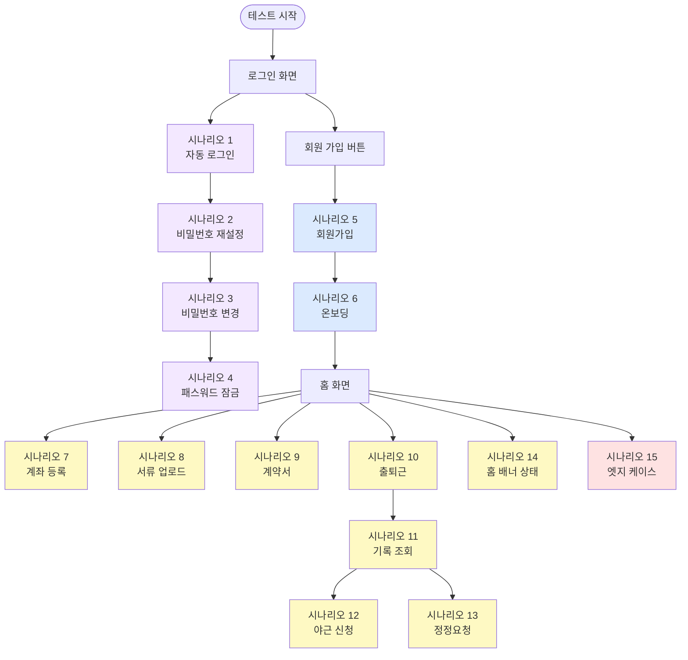
```mermaid
flowchart TD
    A([테스트 시작]) --> B[로그인 화면]
    B --> S1["시나리오 1\n자동 로그인"]
    S1 --> S2["시나리오 2\n비밀번호 재설정"]
    S2 --> S3["시나리오 3\n비밀번호 변경"]
    S3 --> S4["시나리오 4\n패스워드 잠금"]
    B --> C[회원 가입 버튼]
    C --> S5["시나리오 5\n회원가입"]
    S5 --> S6["시나리오 6\n온보딩"]
    S6 --> F[홈 화면]
    F --> S7["시나리오 7\n계좌 등록"]
    F --> S8["시나리오 8\n서류 업로드"]
    F --> S9["시나리오 9\n계약서"]
    F --> S10["시나리오 10\n출퇴근"]
    S10 --> S11["시나리오 11\n기록 조회"]
    S11 --> S12["시나리오 12\n야근 신청"]
    S11 --> S13["시나리오 13\n정정요청"]
    F --> S14["시나리오 14\n홈 배너 상태"]
    F --> S15["시나리오 15\n엣지 케이스"]

    style S1 fill:#f3e8ff
    style S2 fill:#f3e8ff
    style S3 fill:#f3e8ff
    style S4 fill:#f3e8ff
    style S5 fill:#dbeafe
    style S6 fill:#dbeafe
    style S7 fill:#fef9c3
    style S8 fill:#fef9c3
    style S9 fill:#fef9c3
    style S10 fill:#fef9c3
    style S11 fill:#fef9c3
    style S12 fill:#fef9c3
    style S13 fill:#fef9c3
    style S14 fill:#fef9c3
    style S15 fill:#fee2e2
```

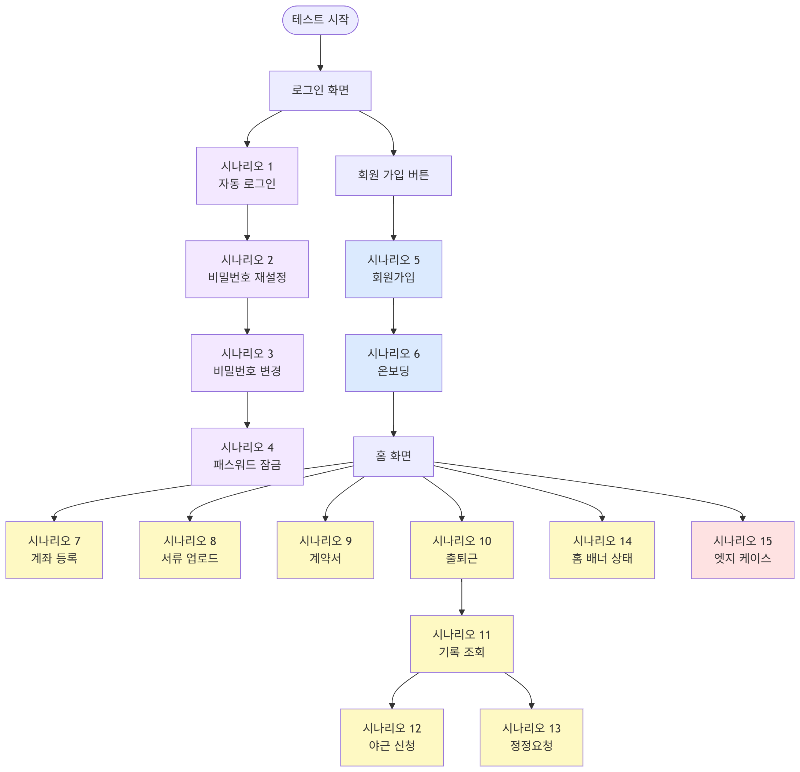

---

## 시나리오 1 — 자동 로그인 테스트 플로우

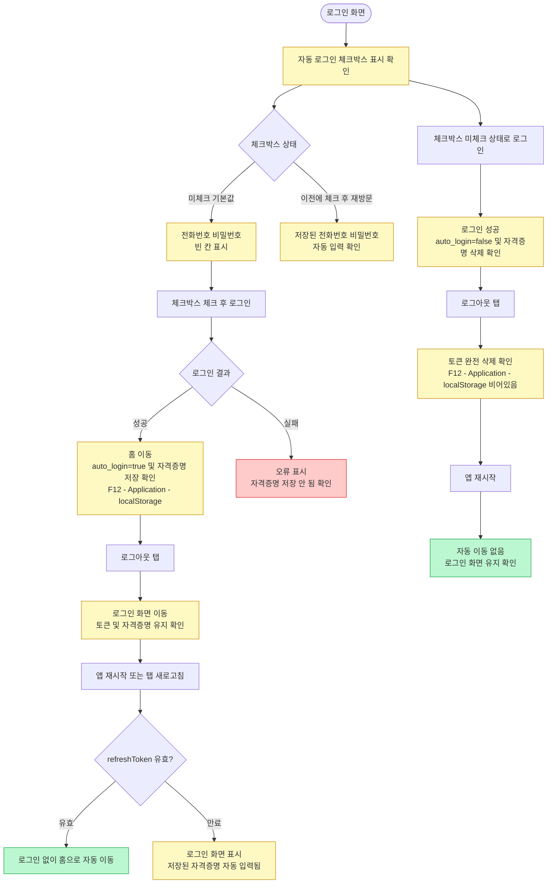
```mermaid
flowchart TD
    A([로그인 화면]) --> B["자동 로그인 체크박스 표시 확인"]:::check

    B --> C{체크박스 상태}
    C -->|미체크 기본값| D["전화번호 비밀번호\n빈 칸 표시"]:::check
    C -->|이전에 체크 후 재방문| E["저장된 전화번호 비밀번호\n자동 입력 확인"]:::check

    D --> F["체크박스 체크 후 로그인"]
    F --> G{로그인 결과}
    G -->|성공| H["홈 이동\nauto_login=true 및 자격증명 저장 확인\nF12 - Application - localStorage"]:::check
    G -->|실패| I["오류 표시\n자격증명 저장 안 됨 확인"]:::fail

    H --> J["로그아웃 탭"]
    J --> K["로그인 화면 이동\n토큰 및 자격증명 유지 확인"]:::check
    K --> L["앱 재시작 또는 탭 새로고침"]
    L --> M{refreshToken 유효?}
    M -->|유효| N["로그인 없이 홈으로 자동 이동"]:::pass
    M -->|만료| O["로그인 화면 표시\n저장된 자격증명 자동 입력됨"]:::check

    B --> P["체크박스 미체크 상태로 로그인"]
    P --> Q["로그인 성공\nauto_login=false 및 자격증명 삭제 확인"]:::check
    Q --> R["로그아웃 탭"]
    R --> S["토큰 완전 삭제 확인\nF12 - Application - localStorage 비어있음"]:::check
    S --> T["앱 재시작"]
    T --> U["자동 이동 없음\n로그인 화면 유지 확인"]:::pass

    classDef pass fill:#bbf7d0,stroke:#16a34a
    classDef fail fill:#fecaca,stroke:#dc2626
    classDef check fill:#fef9c3,stroke:#ca8a04
```

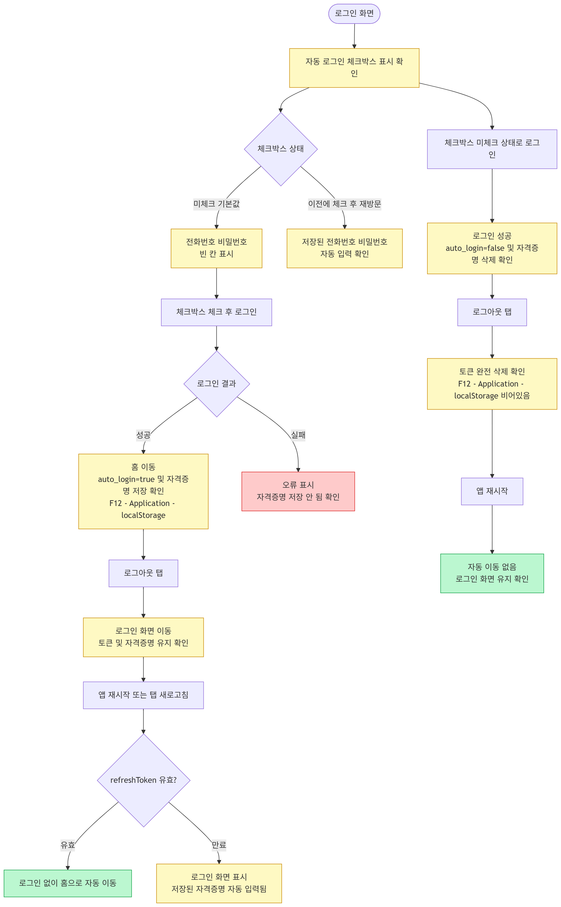

---

## 시나리오 2 — 비밀번호 재설정 플로우

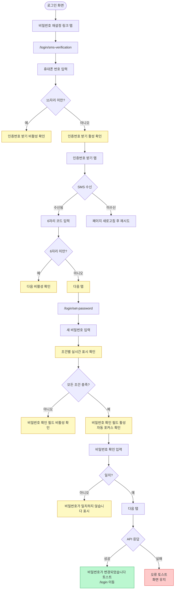
```mermaid
flowchart TD
    A([로그인 화면]) --> B["비밀번호 재설정 링크 탭"]
    B --> C["/login/sms-verification"]

    C --> D[휴대폰 번호 입력]
    D --> E{11자리 미만?}
    E -->|예| F["인증번호 받기 비활성 확인"]:::check
    E -->|아니오| G["인증번호 받기 활성 확인"]:::check
    G --> H["인증번호 받기 탭"]
    H --> I{SMS 수신}
    I -->|수신됨| J[6자리 코드 입력]
    I -->|미수신| K[페이지 새로고침 후 재시도]
    J --> L{6자리 미만?}
    L -->|예| M["다음 비활성 확인"]:::check
    L -->|아니오| N["다음 탭"]:::check
    N --> O["/login/set-password"]

    O --> P[새 비밀번호 입력]
    P --> P1[조건별 실시간 표시 확인]:::check
    P1 --> Q{모든 조건 충족?}
    Q -->|아니오| R["비밀번호 확인 필드 비활성 확인"]:::check
    Q -->|예| S["비밀번호 확인 필드 활성\n자동 포커스 확인"]:::check
    S --> T[비밀번호 확인 입력]
    T --> U{일치?}
    U -->|아니오| V["비밀번호가 일치하지 않습니다 표시"]:::check
    U -->|예| W["다음 탭"]
    W --> X{API 응답}
    X -->|성공| Y["비밀번호가 변경되었습니다 토스트\n/login 이동"]:::pass
    X -->|실패| Z[오류 토스트\n화면 유지]:::fail

    classDef pass fill:#bbf7d0,stroke:#16a34a
    classDef fail fill:#fecaca,stroke:#dc2626
    classDef check fill:#fef9c3,stroke:#ca8a04
```

---

## 시나리오 3 — 비밀번호 변경 플로우 (프로필)

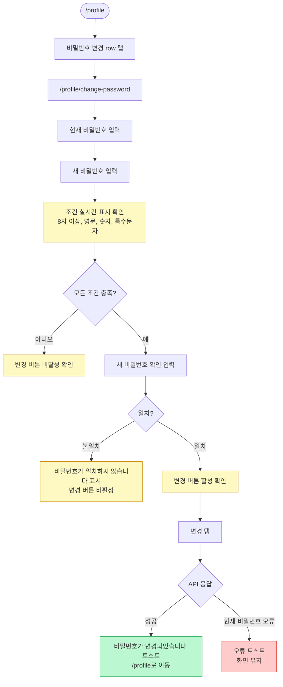
```mermaid
flowchart TD
    A([/profile]) --> B["비밀번호 변경 row 탭"]
    B --> C["/profile/change-password"]

    C --> D["현재 비밀번호 입력"]
    D --> E["새 비밀번호 입력"]
    E --> F[조건 실시간 표시 확인\n8자 이상, 영문, 숫자, 특수문자]:::check
    F --> G{모든 조건 충족?}
    G -->|아니오| H["변경 버튼 비활성 확인"]:::check
    G -->|예| I["새 비밀번호 확인 입력"]
    I --> J{일치?}
    J -->|불일치| K["비밀번호가 일치하지 않습니다 표시\n변경 버튼 비활성"]:::check
    J -->|일치| L["변경 버튼 활성 확인"]:::check
    L --> M["변경 탭"]
    M --> N{API 응답}
    N -->|성공| O["비밀번호가 변경되었습니다 토스트\n/profile로 이동"]:::pass
    N -->|현재 비밀번호 오류| P["오류 토스트\n화면 유지"]:::fail

    classDef pass fill:#bbf7d0,stroke:#16a34a
    classDef fail fill:#fecaca,stroke:#dc2626
    classDef check fill:#fef9c3,stroke:#ca8a04
```

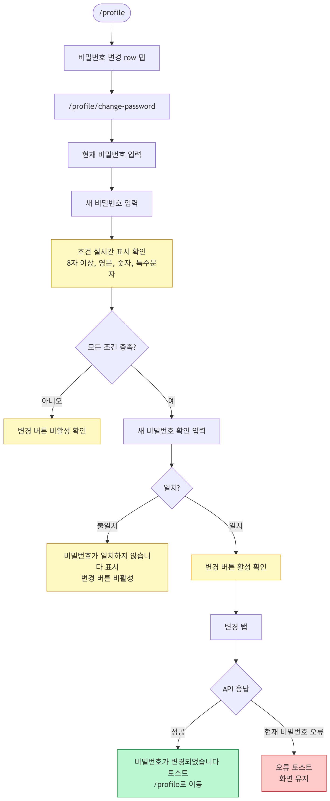

---

## 시나리오 4 — 패스워드 잠금 테스트 플로우

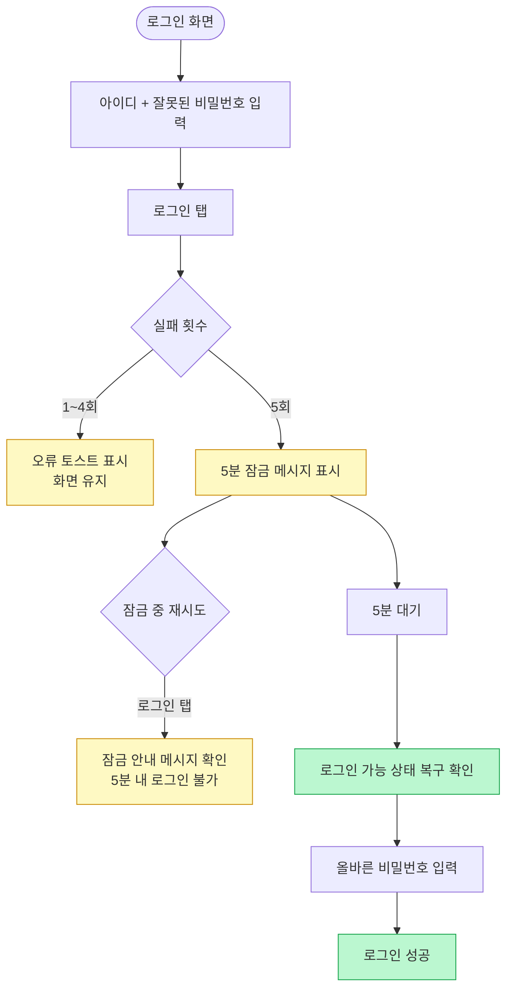
```mermaid
flowchart TD
    A([로그인 화면]) --> B[아이디 + 잘못된 비밀번호 입력]
    B --> C["로그인 탭"]
    C --> D{실패 횟수}
    D -->|1~4회| E["오류 토스트 표시\n화면 유지"]:::check
    D -->|5회| F["5분 잠금 메시지 표시"]:::check

    F --> G{잠금 중 재시도}
    G -->|로그인 탭| H["잠금 안내 메시지 확인\n5분 내 로그인 불가"]:::check

    F --> I[5분 대기]
    I --> J["로그인 가능 상태 복구 확인"]:::pass
    J --> K[올바른 비밀번호 입력]
    K --> L["로그인 성공"]:::pass

    classDef pass fill:#bbf7d0,stroke:#16a34a
    classDef fail fill:#fecaca,stroke:#dc2626
    classDef check fill:#fef9c3,stroke:#ca8a04
```

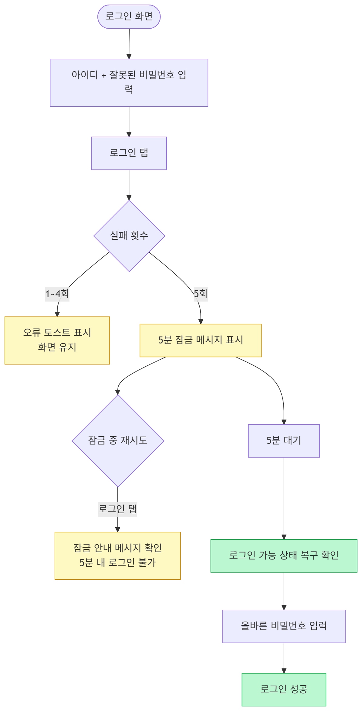

---

## 시나리오 5 — 회원가입 플로우 (인증 → 폼 → 완료)

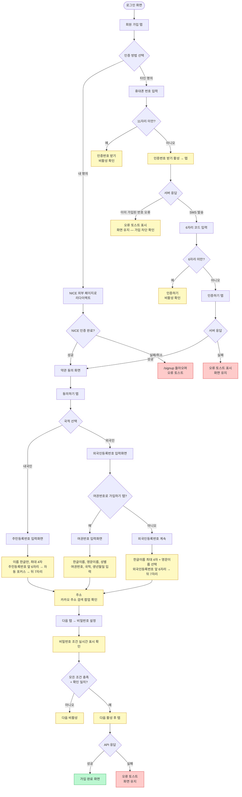
```mermaid
flowchart TD
    A([로그인 화면]) --> B["회원 가입 탭"]
    B --> C{인증 방법 선택}

    C -->|내 명의| D[NICE 외부 페이지로\n리다이렉트]
    D --> D1{NICE 인증 완료?}
    D1 -->|성공| AGR[약관 동의 화면]
    D1 -->|실패/취소| D3["/signup 돌아오며\n오류 토스트"]:::fail

    C -->|타인 명의| E[휴대폰 번호 입력]
    E --> F{11자리 미만?}
    F -->|예| G["인증번호 받기\n비활성 확인"]:::check
    F -->|아니오| H["인증번호 받기 활성 → 탭"]:::check
    H --> ERR{서버 응답}
    ERR -->|이미 가입된 번호 오류| ERROUT["오류 토스트 표시\n화면 유지 — 가입 차단 확인"]:::check
    ERR -->|SMS 발송| K[6자리 코드 입력]
    K --> M{6자리 미만?}
    M -->|예| N["인증하기\n비활성 확인"]:::check
    M -->|아니오| O["인증하기 탭"]
    O --> P{서버 응답}
    P -->|성공| AGR
    P -->|실패| R[오류 토스트 표시\n화면 유지]:::fail

    AGR --> AGR2["동의하기 탭"]
    AGR2 --> NAT{국적 선택}

    NAT -->|내국인| DN[주민등록번호 입력화면]
    NAT -->|외국인| FRN[외국인등록번호 입력화면]
    FRN --> FRN1{"여권번호로 가입하기 탭?"}
    FRN1 -->|예| PN[여권번호 입력화면]
    FRN1 -->|아니오| FRN2[외국인등록번호 계속]

    DN --> DN1["이름 한글만, 최대 4자\n주민등록번호 앞 6자리 → 자동 포커스 → 뒤 7자리"]:::check
    FRN2 --> FRN3["한글이름 최대 4자 + 영문이름 선택\n외국인등록번호 앞 6자리 → 뒤 7자리"]:::check
    PN --> PN1["한글이름, 영문이름, 성별\n여권번호, 국적, 생년월일 입력"]:::check

    DN1 & FRN3 & PN1 --> Z[주소\n카카오 주소 검색 팝업 확인]:::check
    Z --> ZA["다음 탭 → 비밀번호 설정"]
    ZA --> ZC[비밀번호 조건 실시간 표시 확인]:::check
    ZC --> ZD{모든 조건 충족\n+ 확인 일치?}
    ZD -->|아니오| ZE["다음 비활성"]:::check
    ZD -->|예| ZF["다음 활성 후 탭"]:::check
    ZF --> ZG{API 응답}
    ZG -->|성공| ZH[가입 완료 화면]:::pass
    ZG -->|실패| ZI[오류 토스트\n화면 유지]:::fail

    classDef pass fill:#bbf7d0,stroke:#16a34a
    classDef fail fill:#fecaca,stroke:#dc2626
    classDef check fill:#fef9c3,stroke:#ca8a04
```

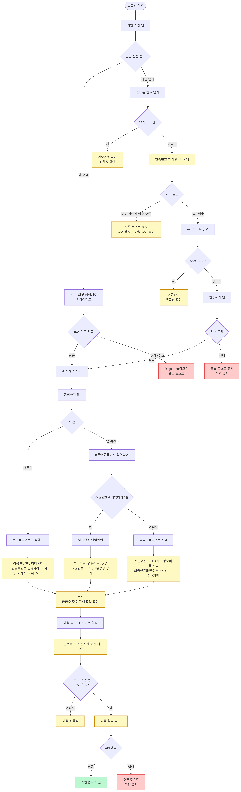

---

## 시나리오 6 — 온보딩 분기 플로우

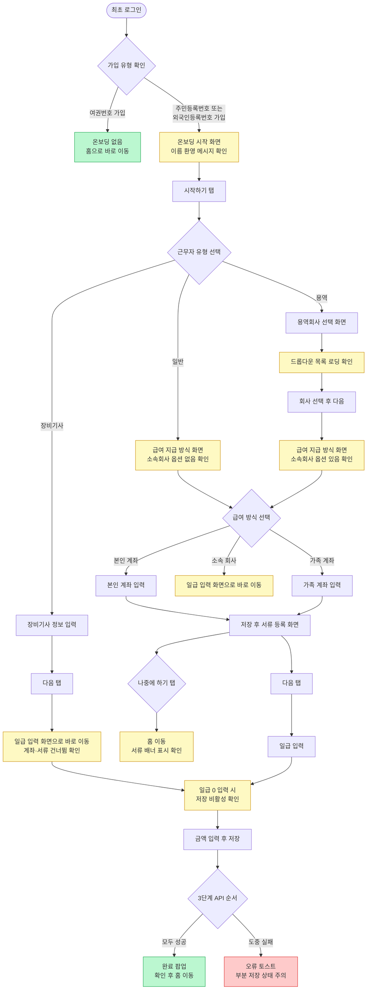
```mermaid
flowchart TD
    A([최초 로그인]) --> AA{가입 유형 확인}
    AA -->|여권번호 가입| AB[온보딩 없음\n홈으로 바로 이동]:::pass
    AA -->|주민등록번호 또는\n외국인등록번호 가입| B

    B[온보딩 시작 화면\n이름 환영 메시지 확인]:::check
    B --> C["시작하기 탭"]
    C --> D{근무자 유형 선택}

    D -->|일반| E[급여 지급 방식 화면\n소속회사 옵션 없음 확인]:::check
    D -->|용역| F[용역회사 선택 화면]
    F --> F1[드롭다운 목록 로딩 확인]:::check
    F1 --> F2["회사 선택 후 다음"]
    F2 --> G[급여 지급 방식 화면\n소속회사 옵션 있음 확인]:::check
    D -->|장비기사| H[장비기사 정보 입력]
    H --> H1["다음 탭"]
    H1 --> H2[일급 입력 화면으로 바로 이동\n계좌·서류 건너뜀 확인]:::check

    E & G --> I{급여 방식 선택}
    I -->|본인 계좌| J[본인 계좌 입력]
    I -->|가족 계좌| K[가족 계좌 입력]
    I -->|소속 회사| L[일급 입력 화면으로 바로 이동]:::check
    J & K --> M[저장 후 서류 등록 화면]

    M --> N{"나중에 하기 탭"}
    N --> N1[홈 이동\n서류 배너 표시 확인]:::check
    M --> O["다음 탭"]
    O --> P[일급 입력]
    H2 & P --> Q["일급 0 입력 시\n저장 비활성 확인"]:::check
    Q --> R["금액 입력 후 저장"]
    R --> S{3단계 API 순서}
    S -->|모두 성공| T["완료 팝업\n확인 후 홈 이동"]:::pass
    S -->|도중 실패| U[오류 토스트\n부분 저장 상태 주의]:::fail

    classDef pass fill:#bbf7d0,stroke:#16a34a
    classDef fail fill:#fecaca,stroke:#dc2626
    classDef check fill:#fef9c3,stroke:#ca8a04
```

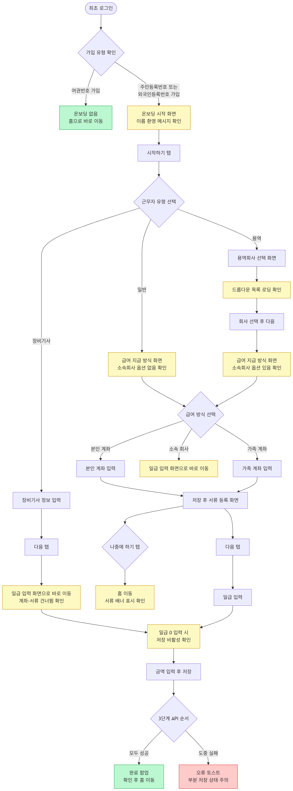

---

## 시나리오 7 — 계좌 등록 테스트 플로우

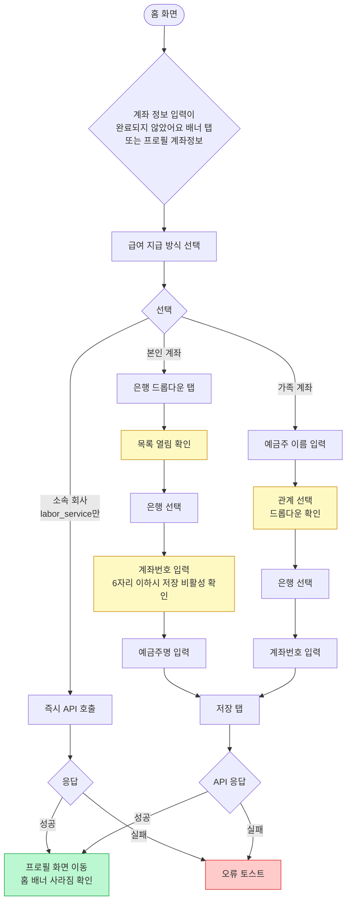
```mermaid
flowchart TD
    A([홈 화면]) --> B{"계좌 정보 입력이\n완료되지 않았어요 배너 탭\n또는 프로필 계좌정보"}
    B --> C[급여 지급 방식 선택]
    C --> D{선택}

    D -->|본인 계좌| E[은행 드롭다운 탭]
    E --> E1[목록 열림 확인]:::check
    E1 --> E2[은행 선택]
    E2 --> E3[계좌번호 입력\n6자리 이하시 저장 비활성 확인]:::check
    E3 --> E4[예금주명 입력]
    E4 --> F["저장 탭"]

    D -->|가족 계좌| G[예금주 이름 입력]
    G --> G1[관계 선택\n드롭다운 확인]:::check
    G1 --> G2[은행 선택]
    G2 --> G3[계좌번호 입력]
    G3 --> F

    D -->|소속 회사\nlabor_service만| H[즉시 API 호출]
    H --> I{응답}
    I -->|성공| J:::pass
    I -->|실패| K[오류 토스트]:::fail

    F --> L{API 응답}
    L -->|성공| J[프로필 화면 이동\n홈 배너 사라짐 확인]:::pass
    L -->|실패| K

    classDef pass fill:#bbf7d0,stroke:#16a34a
    classDef fail fill:#fecaca,stroke:#dc2626
    classDef check fill:#fef9c3,stroke:#ca8a04
```

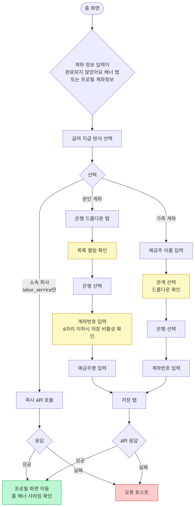

---

## 시나리오 8 — 서류 업로드 테스트 플로우

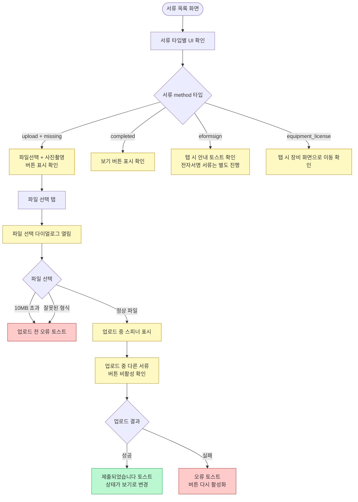
```mermaid
flowchart TD
    A([서류 목록 화면]) --> B[서류 타입별 UI 확인]

    B --> C{서류 method 타입}
    C -->|upload + missing| D[파일선택 + 사진촬영\n버튼 표시 확인]:::check
    C -->|completed| E["보기 버튼 표시 확인"]:::check
    C -->|eformsign| F["탭 시 안내 토스트 확인\n전자서명 서류는 별도 진행"]:::check
    C -->|equipment_license| G[탭 시 장비 화면으로 이동 확인]:::check

    D --> H["파일 선택 탭"]
    H --> I[파일 선택 다이얼로그 열림]:::check
    I --> J{파일 선택}
    J -->|10MB 초과| K[업로드 전 오류 토스트]:::fail
    J -->|잘못된 형식| K
    J -->|정상 파일| L[업로드 중 스피너 표시]:::check
    L --> M[업로드 중 다른 서류\n버튼 비활성 확인]:::check
    M --> N{업로드 결과}
    N -->|성공| O["제출되었습니다 토스트\n상태가 보기로 변경"]:::pass
    N -->|실패| P[오류 토스트\n버튼 다시 활성화]:::fail

    classDef pass fill:#bbf7d0,stroke:#16a34a
    classDef fail fill:#fecaca,stroke:#dc2626
    classDef check fill:#fef9c3,stroke:#ca8a04
```

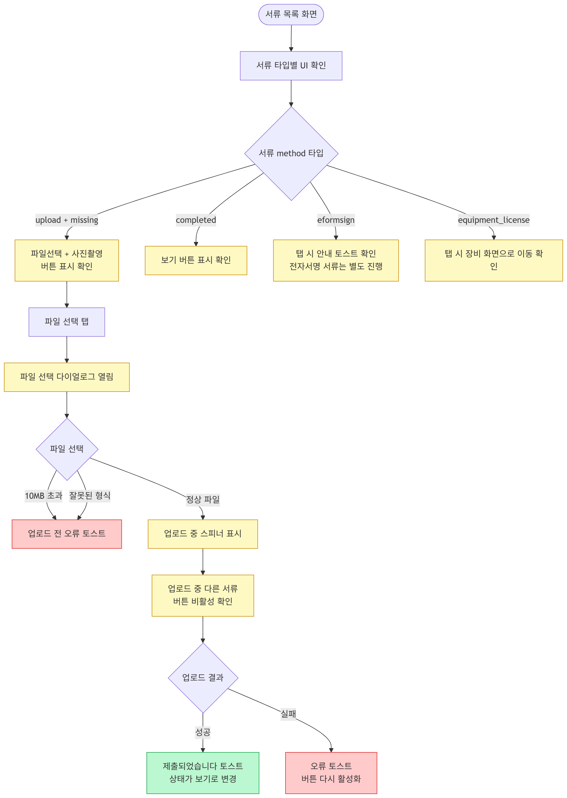

---

## 시나리오 9 — 계약서 테스트 플로우

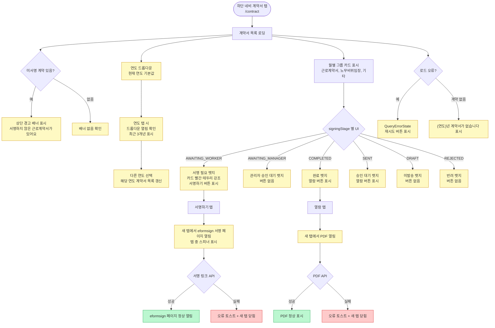
```mermaid
flowchart TD
    A([하단 네비 계약서 탭\n/contract]) --> B["계약서 목록 로딩"]

    B --> B1{미서명 계약 있음?}
    B1 -->|예| B2["상단 경고 배너 표시\n서명하지 않은 근로계약서가 있어요"]:::check
    B1 -->|없음| B3["배너 없음 확인"]:::check

    B --> C["연도 드롭다운\n현재 연도 기본값"]:::check
    C --> C1["연도 탭 시\n드롭다운 열림 확인\n최근 3개년 표시"]:::check
    C1 --> C2["다른 연도 선택\n해당 연도 계약서 목록 갱신"]:::check

    B --> D["월별 그룹 카드 표시\n근로계약서, 노무비위임장, 기타"]

    D --> E{signingStage 별 UI}
    E -->|AWAITING_WORKER| F["서명 필요 뱃지\n카드 빨간 테두리 강조\n서명하기 버튼 표시"]:::check
    E -->|AWAITING_MANAGER| G["관리자 승인 대기 뱃지\n버튼 없음"]:::check
    E -->|COMPLETED| H["완료 뱃지\n열람 버튼 표시"]:::check
    E -->|SENT| I["승인 대기 뱃지\n열람 버튼 표시"]:::check
    E -->|DRAFT| J["미발송 뱃지\n버튼 없음"]:::check
    E -->|REJECTED| K["반려 뱃지\n버튼 없음"]:::check

    F --> L["서명하기 탭"]
    L --> M["새 탭에서 eformsign 서명 페이지 열림\n탭 중 스피너 표시"]:::check
    M --> N{서명 링크 API}
    N -->|성공| O["eformsign 페이지 정상 열림"]:::pass
    N -->|실패| P["오류 토스트 + 새 탭 닫힘"]:::fail

    H --> Q["열람 탭"]
    Q --> R["새 탭에서 PDF 열림"]:::check
    R --> S{PDF API}
    S -->|성공| T["PDF 정상 표시"]:::pass
    S -->|실패| U["오류 토스트 + 새 탭 닫힘"]:::fail

    B --> V{로드 오류?}
    V -->|예| W["QueryErrorState\n재시도 버튼 표시"]:::check
    V -->|계약 없음| X["{연도}년 계약서가 없습니다 표시"]:::check

    classDef pass fill:#bbf7d0,stroke:#16a34a
    classDef fail fill:#fecaca,stroke:#dc2626
    classDef check fill:#fef9c3,stroke:#ca8a04
```

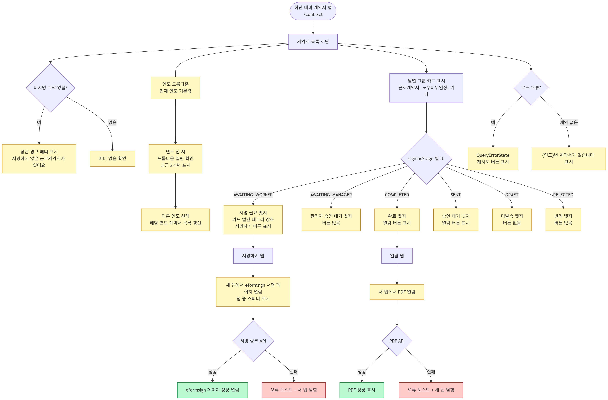

---

## 시나리오 10 — 출퇴근 테스트 플로우

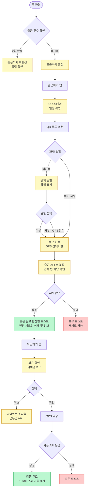
```mermaid
flowchart TD
    A([홈 화면]) --> B{출근 횟수 확인}
    B -->|2회 완료| C["출근하기 비활성\n툴팁 확인"]:::check
    B -->|0~1회| D["출근하기 활성"]:::check

    D --> E["출근하기 탭"]
    E --> F["QR 스캐너\n열림 확인"]:::check
    F --> G[QR 코드 스캔]
    G --> H{GPS 권한}
    H -->|미허용| I["위치 권한\n팝업 표시"]:::check
    I --> I1{권한 선택}
    I1 -->|허용| J["출근 진행\nGPS 선택사항"]:::check
    I1 -->|거부 - GPS 없이| J
    H -->|이미 허용| J
    J --> K["출근 API 호출 중\n연속 탭 차단 확인"]:::check
    K --> L{API 응답}
    L -->|성공| M["출근 완료 현장명 토스트\n현장 체크인 상태 및 정보"]:::pass
    L -->|실패| N["오류 토스트\n재시도 가능"]:::fail

    M --> O["퇴근하기 탭"]
    O --> P["퇴근 확인\n다이얼로그"]:::check
    P --> Q{선택}
    Q -->|취소| R["다이얼로그 닫힘\n근무중 유지"]:::check
    Q -->|확인| S[GPS 요청]
    S --> T{퇴근 API 응답}
    T -->|성공| U[퇴근 완료\n오늘의 근무 기록 표시]:::pass
    T -->|실패| V[오류 토스트]:::fail

    classDef pass fill:#bbf7d0,stroke:#16a34a
    classDef fail fill:#fecaca,stroke:#dc2626
    classDef check fill:#fef9c3,stroke:#ca8a04
```

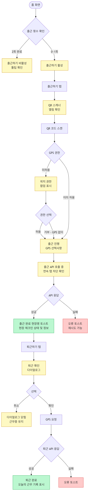

---

## 시나리오 11 — 출퇴근 기록 조회 (달력/목록 뷰)

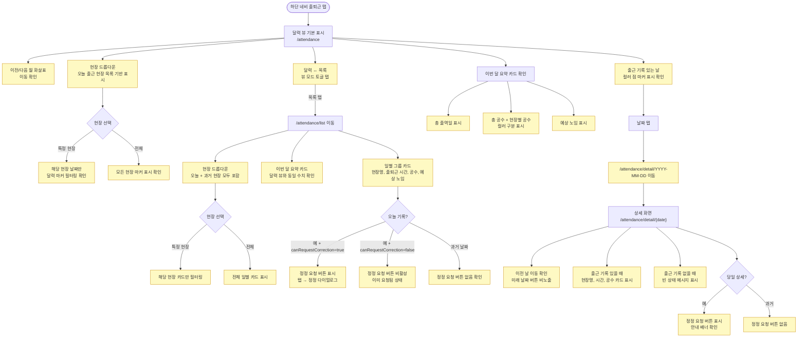
```mermaid
flowchart TD
    A([하단 네비 출퇴근 탭]) --> B["달력 뷰 기본 표시\n/attendance"]

    B --> B1["이전/다음 월 화살표\n이동 확인"]:::check
    B --> B2["달력 ↔ 목록\n뷰 모드 토글 탭"]:::check

    B --> C["현장 드롭다운\n오늘 출근 현장 목록 기반 표시"]:::check
    C --> C1{현장 선택}
    C1 -->|특정 현장| C2["해당 현장 날짜만\n달력 마커 필터링 확인"]:::check
    C1 -->|전체| C3["모든 현장 마커 표시 확인"]:::check

    B --> D["출근 기록 있는 날\n컬러 점 마커 표시 확인"]:::check
    D --> D1["날짜 탭"]
    D1 --> D2["/attendance/detail/YYYY-MM-DD 이동"]:::check

    B --> E["이번 달 요약 카드 확인"]
    E --> E1["총 출역일 표시"]:::check
    E --> E2["총 공수 + 현장별 공수\n컬러 구분 표시"]:::check
    E --> E3["예상 노임 표시"]:::check

    B2 -->|목록 탭| F["/attendance/list 이동"]
    F --> F1["이번 달 요약 카드\n달력 뷰와 동일 수치 확인"]:::check
    F --> F2["현장 드롭다운\n오늘 + 과거 현장 모두 포함"]:::check
    F2 --> F3{현장 선택}
    F3 -->|특정 현장| F4["해당 현장 카드만 필터링"]:::check
    F3 -->|전체| F5["전체 일별 카드 표시"]:::check

    F --> F6["일별 그룹 카드\n현장명, 출퇴근 시간, 공수, 예상 노임"]:::check
    F6 --> F7{오늘 기록?}
    F7 -->|예 + canRequestCorrection=true| F8["정정 요청 버튼 표시\n탭 → 정정 다이얼로그"]:::check
    F7 -->|예 + canRequestCorrection=false| F9["정정 요청 버튼 비활성\n이미 요청됨 상태"]:::check
    F7 -->|과거 날짜| F10["정정 요청 버튼 없음 확인"]:::check

    D2 --> G["상세 화면 /attendance/detail/{date}"]
    G --> G1["이전 날 이동 확인\n미래 날짜 버튼 비노출"]:::check
    G --> G2["출근 기록 있을 때\n현장명, 시간, 공수 카드 표시"]:::check
    G --> G3["출근 기록 없을 때\n빈 상태 메시지 표시"]:::check
    G --> G4{당일 상세?}
    G4 -->|예| G5["정정 요청 버튼 표시\n안내 배너 확인"]:::check
    G4 -->|과거| G6["정정 요청 버튼 없음"]:::check

    classDef pass fill:#bbf7d0,stroke:#16a34a
    classDef fail fill:#fecaca,stroke:#dc2626
    classDef check fill:#fef9c3,stroke:#ca8a04
```

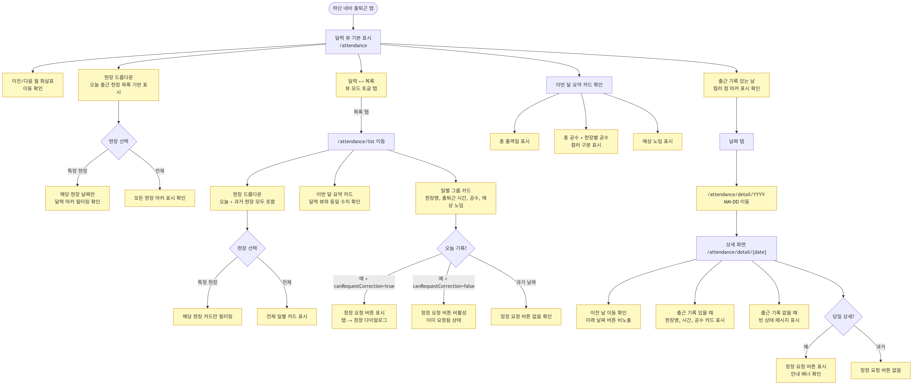

---

## 시나리오 12 — 야근 신청 플로우

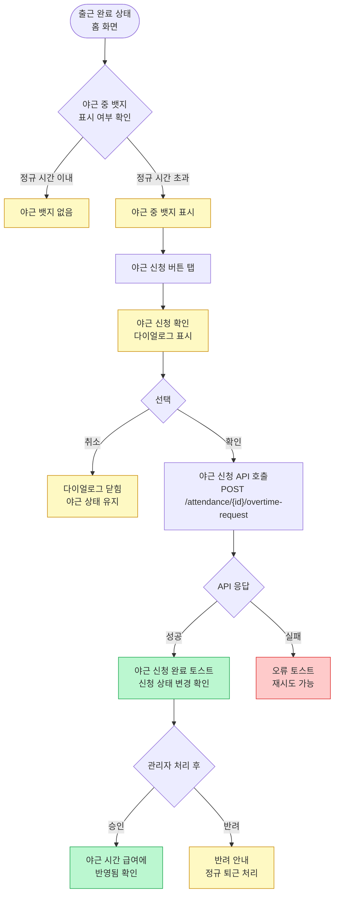
```mermaid
flowchart TD
    A([출근 완료 상태\n홈 화면]) --> B{"야근 중 뱃지\n표시 여부 확인"}
    B -->|정규 시간 이내| C["야근 뱃지 없음"]:::check
    B -->|정규 시간 초과| D["야근 중 뱃지 표시"]:::check

    D --> E["야근 신청 버튼 탭"]
    E --> F["야근 신청 확인\n다이얼로그 표시"]:::check
    F --> G{선택}
    G -->|취소| H["다이얼로그 닫힘\n야근 상태 유지"]:::check
    G -->|확인| I["야근 신청 API 호출\nPOST /attendance/{id}/overtime-request"]
    I --> J{API 응답}
    J -->|성공| K["야근 신청 완료 토스트\n신청 상태 변경 확인"]:::pass
    J -->|실패| L["오류 토스트\n재시도 가능"]:::fail

    K --> M{관리자 처리 후}
    M -->|승인| N["야근 시간 급여에\n반영됨 확인"]:::pass
    M -->|반려| O["반려 안내\n정규 퇴근 처리"]:::check

    classDef pass fill:#bbf7d0,stroke:#16a34a
    classDef fail fill:#fecaca,stroke:#dc2626
    classDef check fill:#fef9c3,stroke:#ca8a04
```

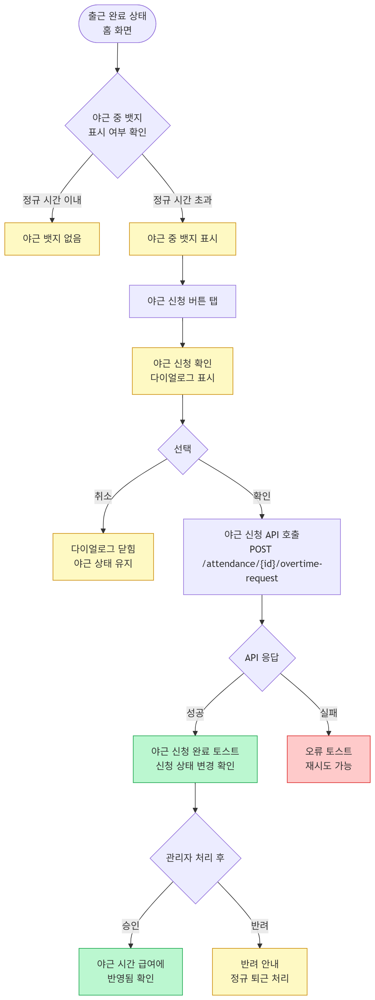

---

## 시나리오 13 — 출퇴근 정정요청 플로우

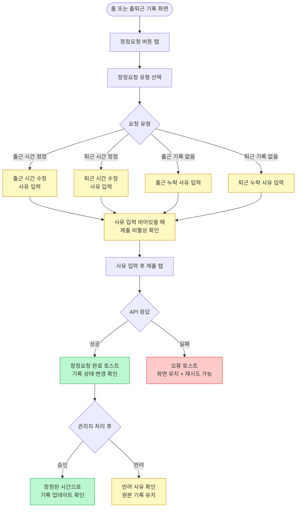
```mermaid
flowchart TD
    A([홈 또는 출퇴근 기록 화면]) --> B["정정요청 버튼 탭"]
    B --> C["정정요청 유형 선택"]

    C --> D{요청 유형}
    D -->|출근 시간 정정| E["출근 시간 수정\n사유 입력"]:::check
    D -->|퇴근 시간 정정| F["퇴근 시간 수정\n사유 입력"]:::check
    D -->|출근 기록 없음| G["출근 누락 사유 입력"]:::check
    D -->|퇴근 기록 없음| H["퇴근 누락 사유 입력"]:::check

    E & F & G & H --> I["사유 입력 비어있을 때\n제출 비활성 확인"]:::check
    I --> J["사유 입력 후 제출 탭"]
    J --> K{API 응답}
    K -->|성공| L["정정요청 완료 토스트\n기록 상태 변경 확인"]:::pass
    K -->|실패| M["오류 토스트\n화면 유지 + 재시도 가능"]:::fail

    L --> N{관리자 처리 후}
    N -->|승인| O["정정된 시간으로\n기록 업데이트 확인"]:::pass
    N -->|반려| P["반려 사유 확인\n원본 기록 유지"]:::check

    classDef pass fill:#bbf7d0,stroke:#16a34a
    classDef fail fill:#fecaca,stroke:#dc2626
    classDef check fill:#fef9c3,stroke:#ca8a04
```

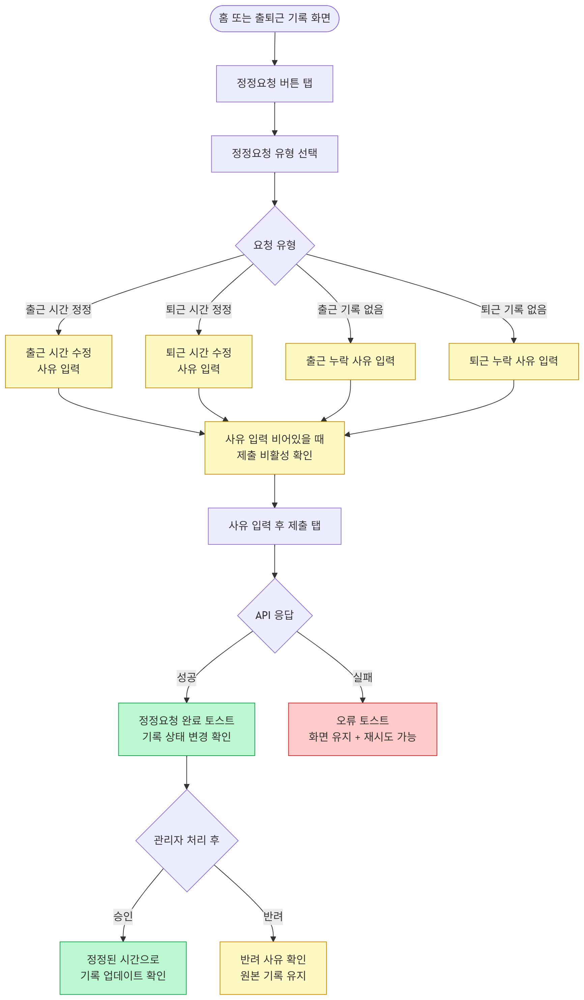

---

## 시나리오 14 — 홈 배너 상태 매트릭스

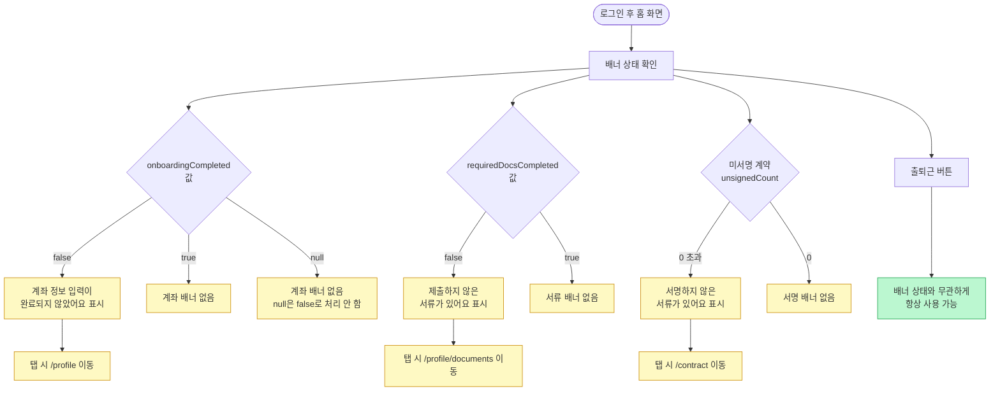
```mermaid
flowchart TD
    A([로그인 후 홈 화면]) --> B[배너 상태 확인]

    B --> C{onboardingCompleted\n값}
    C -->|false| D["계좌 정보 입력이\n완료되지 않았어요 표시"]:::check
    C -->|true| E[계좌 배너 없음]:::check
    C -->|null| F[계좌 배너 없음\nnull은 false로 처리 안 함]:::check

    B --> G{requiredDocsCompleted\n값}
    G -->|false| H["제출하지 않은\n서류가 있어요 표시"]:::check
    G -->|true| I[서류 배너 없음]:::check

    B --> J{미서명 계약\nunsignedCount}
    J -->|0 초과| K["서명하지 않은\n서류가 있어요 표시"]:::check
    J -->|0| L[서명 배너 없음]:::check

    B --> M[출퇴근 버튼]
    M --> N[배너 상태와 무관하게\n항상 사용 가능]:::pass

    D --> O[탭 시 /profile 이동]:::check
    H --> P[탭 시 /profile/documents 이동]:::check
    K --> Q[탭 시 /contract 이동]:::check

    classDef pass fill:#bbf7d0,stroke:#16a34a
    classDef fail fill:#fecaca,stroke:#dc2626
    classDef check fill:#fef9c3,stroke:#ca8a04
```

---

## 체크리스트 요약

### 회원가입
- [ ] 내국인 SMS 인증 → 주민번호 → 비밀번호 → 완료
- [ ] 외국인 외국인등록번호 경로
- [ ] 외국인 여권번호 경로
- [ ] 한글 이름 5자 오류 메시지 표시
- [ ] 주민번호 앞자리 6자 시 자동 포커스 이동
- [ ] 카카오 주소 검색 동작
- [ ] 비밀번호 조건 실시간 표시

### 동일 휴대폰 번호 가입 차단 (시나리오 3)
- [ ] 이미 가입된 번호로 인증번호 요청 시 오류 토스트 표시
- [ ] 인증 통과 후 회원가입 API에서 중복 번호 차단 확인
- [ ] 차단 시 사용자에게 이미 가입된 번호임 안내 확인

### 온보딩
- [ ] 일반 근무자 전체 플로우
- [ ] 용역 근무자 (소속회사 옵션 표시, 용역회사 선택)
- [ ] 장비기사 (급여계좌·서류 건너뜀 확인)
- [ ] 서류 "나중에 하기" 후 홈 배너 표시
- [ ] 뒤로가기 시 로그아웃 다이얼로그

### 프로필 수정
- [ ] 주소 변경 저장 성공
- [ ] 변경 없을 때 저장 버튼 비활성화

### 계좌 등록
- [ ] 본인 계좌 저장 후 배너 사라짐
- [ ] 가족 계좌 저장
- [ ] 계좌번호 6자리 이하 저장 불가

### 서류 업로드
- [ ] 파일 선택 업로드 성공
- [ ] 10MB 초과 파일 오류 토스트
- [ ] 업로드 완료 후 "보기" 버튼으로 변경

### 비밀번호 재설정 (시나리오 6)
- [ ] 로그인 화면 → "비밀번호 재설정" 링크 탭 → SMS 인증 화면 이동
- [ ] 11자리 미만 시 "인증번호 받기" 비활성화
- [ ] SMS 수신 후 6자리 입력 → "다음" 활성화
- [ ] 새 비밀번호 조건 실시간 표시 (8자+, 영문, 숫자, 특수문자)
- [ ] 조건 미충족 시 비밀번호 확인 필드 비활성화
- [ ] 비밀번호 불일치 시 오류 문구 표시
- [ ] 성공 시 "비밀번호가 변경되었습니다" 토스트 + 로그인 화면 이동

### 패스워드 잠금 (시나리오 7)
- [ ] 잘못된 비밀번호 1~4회 시 오류 토스트 표시
- [ ] 5회 실패 시 5분 잠금 메시지 표시
- [ ] 잠금 중 로그인 시도 시 잠금 안내 메시지 확인
- [ ] 5분 후 로그인 가능 상태 복구 확인

### 출퇴근
- [ ] QR 스캔 → GPS → 출근 완료
- [ ] 퇴근 다이얼로그 → 퇴근 완료
- [ ] 하루 2회 출근 후 버튼 비활성화

### 엣지 케이스
- [ ] 네트워크 오프라인 시 토스트 표시 (흰 화면 없음)
- [ ] 탭 닫기 후 재진입 시 처음부터 시작
- [ ] 온보딩 뒤로가기 → 로그아웃 다이얼로그

---

## 버그 보고 양식

버그 발견 시 아래 내용을 포함하여 보고해 주세요.

1. **재현 경로**: 어떤 단계에서 발생했는지 (예: 회원가입 → 주민번호 입력 → 저장)
2. **입력값**: 어떤 값을 입력했는지
3. **기대 결과**: 어떻게 동작해야 하는지 (가이드의 🟩 초록 노드 참고)
4. **실제 결과**: 실제로 어떻게 동작했는지
5. **스크린샷 또는 화면 녹화**
6. **기기 및 브라우저**: 예) iPhone 15 / Safari, Galaxy S23 / Chrome

---

## 시나리오 15 — 엣지 케이스 테스트 플로우

```mermaid
flowchart TD
    A([엣지 케이스 시작]) --> B{케이스 선택}

    B -->|탭 닫기| C[SMS 인증 완료 후\n주민번호 입력 중\n탭 닫고 다시 열기]
    C --> C1{처음부터 시작?}
    C1 -->|예 - 정상| C2[sessionStorage 초기화 확인]:::pass
    C1 -->|아니오 - 비정상| C3[버그 보고]:::fail

    B -->|5자 이름| D[이름 입력 필드에\n5자 한글 입력 시도]
    D --> D1{결과}
    D1 -->|4자 잘림 + 오류 문구| D2[정상]:::pass
    D1 -->|5자 입력됨| D3[버그 보고]:::fail

    B -->|네트워크 오프라인| E[F12 → Network\nOffline 설정]
    E --> F[인증번호 받기 탭]
    F --> F1{결과}
    F1 -->|오류 토스트 표시| F2[정상]:::pass
    F1 -->|흰 화면 또는 무반응| F3[버그 보고]:::fail

    B -->|온보딩 뒤로가기| G[온보딩 중 뒤로가기 탭]from 
    G --> G1[나가기 다이얼로그 표시]:::check
    G1 --> H{선택}
    H -->|나가기| I[로그아웃 → 로그인 화면]:::pass
    H -->|계속하기| J[온보딩 화면 유지]:::pass

    B -->|비밀번호 64자 초과| K[65자 이상 입력]
    K --> K1{결과}
    K1 -->|오류 문구 표시| K2[정상]:::pass
    K1 -->|오류 없이 입력됨| K3[버그 보고]:::fail

    classDef pass fill:#bbf7d0,stroke:#16a34a
    classDef fail fill:#fecaca,stroke:#dc2626
    classDef check fill:#fef9c3,stroke:#ca8a04
```

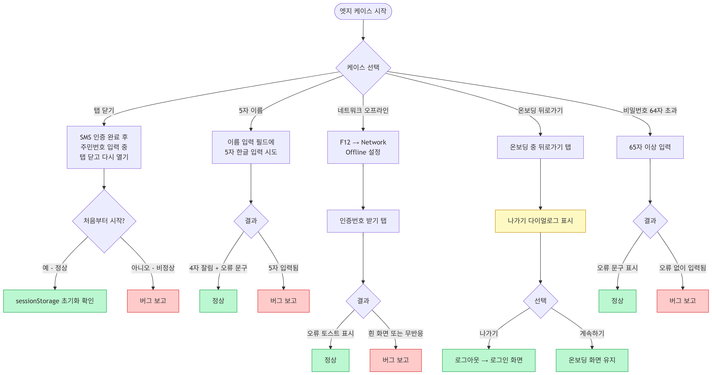
